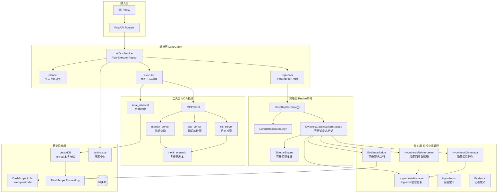
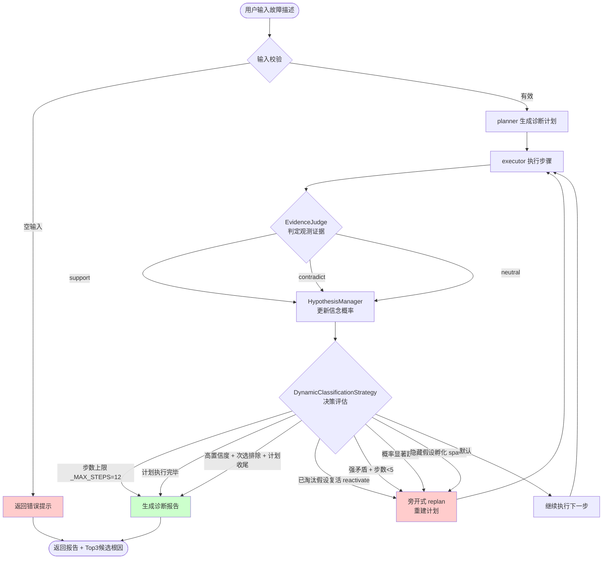
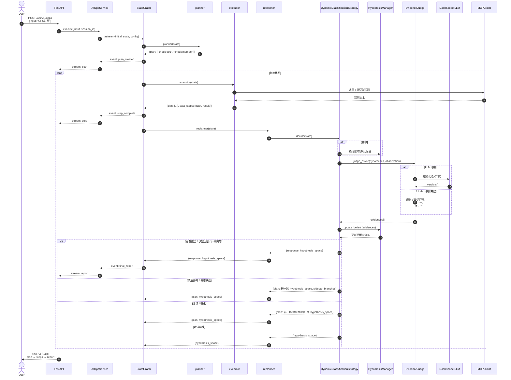
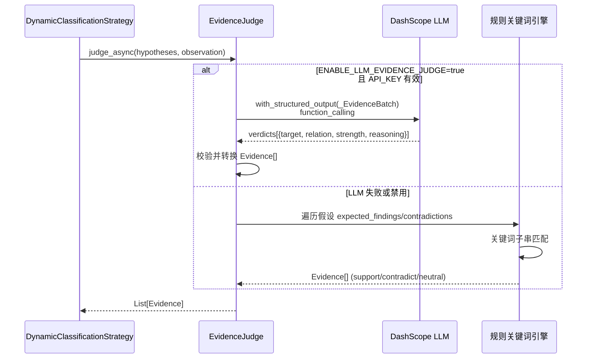
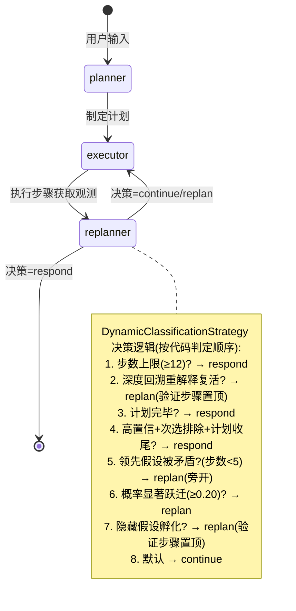
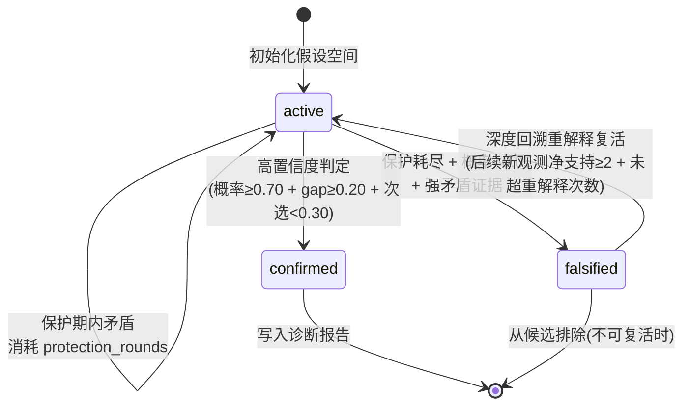
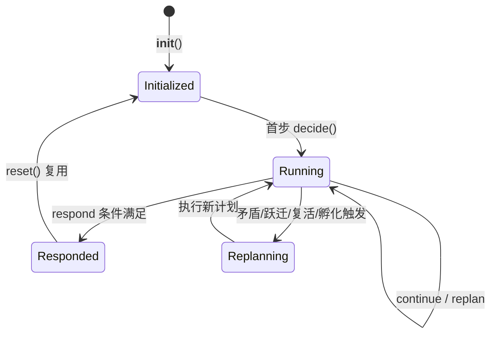

# 项目理解清单：rag-aiops-thesis 架构与流程梳理

> 本文档基于 `thesis-dynamic-classification-v2` 分支代码，聚焦 AIOps 旁开式动态分类故障诊断机制。

---

## 1. 架构图：分层、模块边界、依赖关系



### 模块职责

| 模块 | 职责 | 关键文件 |
|------|------|----------|
| 接入层 | HTTP API 暴露、鉴权、参数校验 | `src/api/routers/aiops.py` |
| 编排层 | LangGraph 状态图装配与流式执行；策略实例注入 + 每轮诊断前 `reset()`（会话隔离） | `src/agent/aiops/graph.py` |
| 编排层 · executor | 工具调用（ReAct 循环、超时保护、检索词净化）；**方案 C** 本地日志降级读取（`runtime/log_cache` 兜底）；**方案 D** search_log topic_id 对齐（历史真实 topic 覆盖自动生成值） | `src/agent/aiops/executor.py` |
| 策略层 | Replan 决策逻辑（可插拔）：`DefaultReplanStrategy`（基线）/ `DynamicClassificationStrategy`（旁开式动态分类 + 证据充分性门控） | `src/agent/aiops/strategies/*.py` |
| 核心层 | 假设空间管理、信念更新、证据裁判、孵化与复活 | `src/agent/aiops/core/*.py` |
| 工具层 · MCP | 按 server 逐个加载（**方案 A** 单点故障只丢该 server，其余保留） | `src/agent/mcp_client.py` |
| 工具层 · 服务 | 指标（monitor）/ 日志（cls）/ 知识库（rag）；cls 每次成功 `search_log` 落盘日志副本供降级 | `mcp_servers/*.py` |
| 基础设施层 | LLM、嵌入、向量库、配置 | `src/llm/`, `src/embedding/`, `src/settings.py` |

---

## 2. 流程图：业务步骤、分支与异常路径



### 分支说明

| 分支条件 | 触发场景 | 输出 |
|----------|----------|------|
| **高置信度 respond** | top概率≥0.70 且 ≥0.50地板、gap≥0.20、次选<0.30，且(计划剩余≤1 且 步数≥3) 或 步数≥4 | `response` + `hypothesis_space` |
| **步数上限** | 已执行12步 | 强制报告 |
| **计划完毕** | plan为空且已有执行历史 | 报告 |
| **矛盾旁开 replan** | 领先假设被强矛盾，且步数<5 | `plan` + `hypothesis_space` |
| **概率跃迁 replan** | top概率较上次变化≥0.20 | `plan` + `hypothesis_space` |
| **已淘汰假设复活 replan** | 深度回溯复查发现已 falsified 假设在后续观测中获得净支持证据 | `plan`(验证步骤置顶) + `hypothesis_space` |
| **隐藏假设孵化 replan** | 步数≥2 且 top<0.35 且已观测非中性证据（或输入携带隐藏线索） | `plan`(验证步骤置顶) + `hypothesis_space` |
| **默认 continue** | 不满足上述任何条件 | `hypothesis_space` |

### 异常路径

```
1. 输入为空 → 直接返回 validation_error
2. LLM 证据裁判失败 → 自动降级到规则关键词兜底
3. MCP 服务超时 → executor 返回错误信息，作为观测继续
4. 保护期内矛盾 → 消耗保护轮数，不淘汰假设
5. 全正常观测 → 扁平分布，继续执行直到计划完毕
6. 任一 MCP server 连接失败 → 方案 A：按 server 容错，只丢弃该 server 工具，其余保留
7. cls 停服（search_log 不可达）→ 方案 C：executor 从 `runtime/log_cache/{topic}.json` 本地降级读取，观测与在线等价且来源可审计（报告标注）；无缓存时走方案 B 诚实标注"证据不足"
8. 重规划验证步骤 topic 漂移（stub/LLM 提取不到服务名回退默认值）→ 方案 D：executor 用历史真实 topic_id 覆盖，保证降级/在线读取同主题
9. 证据源缺失/降级 → 方案 B：`_evidence_sufficiency_problem` 检测 → 报告头部 `diagnostic_meta.evidence_sufficiency`（ok/degraded/missing）+ `conclusion_state` 五态，信息不足不虚报确定结论
```

---

## 3. 时序图：调用顺序、参与方与交互

### 3.1 单次诊断完整时序



### 3.2 证据裁判内部时序



---

## 4. 数据流向：从哪来、到哪去、如何变换

### 4.1 主数据流

```mermaid
flowchart LR
    subgraph 输入
        A[用户故障描述<br/>String]
    end

    subgraph 状态 [PlanExecuteState]
        B[input: str]
        C[plan: List[str]]
        D[past_steps: List[(str, str)]]
        E[response: str]
        F[hypothesis_space: List[dict]]
    end

    subgraph 变换
        T1[planner<br/>input → plan]
        T2[executor<br/>plan[0] + tools → observation]
        T3[EvidenceJudge<br/>observation + patterns → evidences]
        T4[HypothesisManager<br/>prior_prob + evidences → new_prob]
        T5[DynamicClassificationStrategy<br/>prob_dist → decision]
        T6[_local_respond<br/>past_steps + top3 → report]
    end

    subgraph 输出
        G[SSE 流式事件]
        H[诊断报告 Markdown]
        I[假设空间快照 JSON]
    end

    A --> B
    B --> T1 --> C
    C --> T2 --> D
    D --> T3
    T3 --> T4 --> F
    F --> T5
    T5 -->|respond| T6 --> E
    T5 -->|replan| C
    T5 -->|continue| C
    E --> H
    F --> I
    H --> G
```

### 4.2 信念更新数据变换公式

```
输入: prior_prob (先验概率), evidence (证据)
输出: new_prob (后验概率)

logit(p) = ln(p / (1-p))

if evidence.relation == "support":
    delta = evidence.strength * 1.5
elif evidence.relation == "contradict":
    delta = -evidence.strength * 2.5
else:
    delta = 0

new_logit = logit(prior) + delta
new_prob = 1 / (1 + exp(-new_logit))
new_prob = clamp(new_prob, 0.01, 0.99)
```

### 4.3 证据强度计算

```
输入: hits (命中关键词列表), patterns (模式列表)
输出: strength (0~1)

tiers = [0.35, 0.25, 0.20]
base = sum(tiers[:len(hits)]) + 0.10 * max(0, len(hits)-3) + 0.20
strength = min(round(base, 2), 1.0)

示例:
  1 hit → 0.55
  2 hits → 0.80
  3 hits → 1.00
```

---

## 5. 状态变换：对象生命周期与状态机

### 5.1 LangGraph 状态机



### 5.2 假设生命周期状态机



### 5.3 PlanExecuteState 字段变换矩阵

| 阶段 | input | plan | past_steps | response | hypothesis_space |
|------|-------|------|------------|----------|------------------|
| 初始 | 用户描述 | `[]` | `[]` | `""` | 未设置 |
| planner后 | 不变 | `["step1", ...]` | 不变 | `""` | 未设置 |
| executor后 | 不变 | 弹出首步 | 追加 `(step, result)` | `""` | 未设置 |
| replanner continue | 不变 | 不变 | 不变 | `""` | 更新 |
| replanner replan | 不变 | 替换为新计划 | 不变 | `""` | 更新 |
| replanner respond | 不变 | 不变 | 不变 | 报告 Markdown | 更新 |

### 5.4 DynamicClassificationStrategy 内部状态



| 状态变量 | 类型 | 生命周期 | 说明 |
|----------|------|----------|------|
| `manager` | HypothesisManager | 每次诊断新建 | 假设空间容器 |
| `judge` | EvidenceJudge | 实例级别复用 | 证据裁判器（含LLM） |
| `_step_count` | int | 每步递增 | 已执行步数 |
| `_last_top_prob` | float | 每步更新 | 上次领先假设概率（用于跃迁检测） |
| `_evidence_seen` | bool | 每步更新 | 是否已观测到非中性证据（孵化门控依据） |
| `_belief_history` | list | 每步追加 | 各假设概率序列（可视化信念曲线） |
| `sidebar_engine` | SidebarEngine | 每次诊断新建 | 旁开验证支线引擎 |
| `_sidebar_branches` | list[SidebarBranch] | 每次诊断新建 | 已开辟的旁开分支 |
| `hypothesis_generator` | HypothesisGenerator | 每次诊断新建 | 隐藏假设孵化器（线索库） |
| `reinterpreter` | HypothesisReinterpreter | 每次诊断新建 | 深度回溯重解释器（复活） |

---

## 附录：关键阈值常量

| 常量 | 值 | 说明 |
|------|-----|------|
| `_RESPOND_THRESHOLD` | 0.70 | 高置信度 respond 概率门槛 |
| `_RESPOND_CONFIDENCE_FLOOR` | 0.50 | 最低置信地板 |
| `_MIN_GAP_FOR_RESPOND` | 0.20 | 与次选最小差距 |
| `_RUNNER_UP_EXCLUDED_THRESHOLD` | 0.30 | 次选必须低于此值才算"排除" |
| `_REPLAN_TRIGGER_DELTA` | 0.20 | 概率跃迁触发 replan 的差值 |
| `_MAX_STEPS` | 12 | 最大执行步数（配合 planner 6 步上限，为 replan 换向预留空间） |
| `_NO_REPLAN_AFTER` | 5 | 超过此步数不再触发矛盾 replan |
| `_SIDEBAR_PLAN_CAP` | 6 | 旁开合并后计划上限（与 planner 上限一致） |
| `_INCUBATE_AFTER_STEPS` | 2 | 隐藏假设孵化最少执行步数 |
| `_INCUBATE_TOP_THRESHOLD` | 0.35 | 孵化触发 top 概率上限 |
| `support_strength` | 1.5 | 支持证据 logit 系数 |
| `contradiction_strength` | 2.5 | 矛盾证据 logit 系数 |
| `strong_contradiction_threshold` | 0.7 | 强矛盾判定强度门槛 |
| `protection_rounds` | 2 | 新建假设保护轮数 |
| 复活净支持门槛 | 2 | 淘汰后需达到的支持-矛盾命中差 |
| 复活概率 / 保护轮数 | 0.30 / 2 | 深度回溯复活后的初始概率与保护 |
| `_SEVERITY_WEIGHT` | 1.0/0.9/0.45 | ERROR/WARN/INFO 支持证据加权乘子 |
| 故障注入锁定强度 | 0.9 | 规则裁判对网络假设的锁定强度 |

---

## 附录：修复记录

| 日期 | 类型 | 问题 | 修复 | 涉及文件 |
|------|------|------|------|----------|
| 2026-09-04 | 端到端验收 | llm_stub 路由被 executor 拼接的历史步骤污染（全文匹配 `"cpu" in user` 恒命中），所有步骤误调 CPU 工具 | 只提取"请执行以下诊断步骤"后的当前步骤路由，优先匹配"（调用 工具名）"精确格式 | `scripts/llm_stub.py` |
| 2026-09-04 | 端到端验收 | 策略全局单例未做会话隔离（graph.execute 从不调用 reset），上一轮假设概率泄漏带偏后续场景 | `BaseReplanStrategy` 新增 `reset()` 钩子，`execute()` 每轮诊断前调用；有状态策略(DynamicClassificationStrategy)清理假设空间/信念历史 | `src/agent/aiops/strategies/base.py`, `src/agent/aiops/graph.py` |
| 2026-09-07 | 复杂场景扩展 | 新增多症状叠加 + 级联故障两个真实场景剧本，验证定位层级区分与因果链优先 | `complex_overload`(billing)：CPU 不上告警 + OOM 堆栈 vs 通用"超时"词；`cascade_dependency`(inventory)：503/缓存不可达(链首) vs MQ lag/线程池积压(级联)。配套 llm_stub 日志摘要从"只回显第一条"增强为完整输出 ERROR/WARN 前 5 条 | `mcp_servers/mock_scenario.py`, `mcp_servers/cls_server.py`, `scripts/llm_stub.py`, `scripts/verify_scenarios.py`, `tests/test_mock_scenario.py` |
| 2026-09-07 | 端到端护栏 | 混沌注入根因锁定端到端验证 + 长诊断步数上限护栏 | 新增混沌注入验收场景(api-gateway topic-003 混沌剧本 → 网络 support 0.9 锁定)；verify 脚本统计每场景步数并断言 ≤ `_MAX_STEPS`(12)，防死循环 | `scripts/verify_scenarios.py` |
| 2026-09-07 | 校准实验 | 盲测批量场景初跑全误判基础设施——llm_stub `_extract_service` 无法识别 blind-svc，回退 `_last_svc`(data-sync-service)，指标走 infra 剧本、日志查错主题 | `_SVC_TO_TOPIC` 新增 `blind-svc → topic-blind` 映射；修复后盲测 40/40 命中 | `scripts/llm_stub.py` |
| 2026-09-07 | 鲁棒性F组 | MCP 客户端 `asyncio.gather`(return_exceptions=False) 任一 server 连接失败即抛 ExceptionGroup，已加载工具整体丢弃——停 1 个 MCP 服务 = 8 工具全无 | `load_mcp_tools_safe` 改为按 server 逐个加载，单点失败只丢该 server，其余保留；executor `_get_tools_cached` 部分可用时保留工具。收益：停 monitor 命中率 5/8→8/8 | `src/agent/mcp_client.py`, `src/agent/aiops/executor.py` |
| 2026-09-07 | 鲁棒性F组 | cls 停服下日志证据物理缺失，网络/OOM/混沌/依赖 4 类场景失鉴别力（5/8，3 个虚报确定） | 方案B：`_evidence_sufficiency_problem` 证据充分性门控，`_local_respond` 输出"结论(证据不足)"诚实标注不虚报；方案C：cls_server 每次 search_log 落盘 `runtime/log_cache/{topic}.json`（模拟"日志有本地副本"），executor 在 `search_log` 不可达时降级读本地缓存。停 cls 实测命中率 5/8→**7/8**（2026-09-08 复验；网络场景经方案 D 对齐修复判对，场景 1 残差为单源指标证据不足的诚实 uncertain） | `src/agent/aiops/strategies/dynamic_classification.py`, `mcp_servers/cls_server.py`, `src/agent/aiops/executor.py` |
| 2026-09-08 | 鲁棒性F组 | 复验发现方案 C 降级路径 topic 漂移：重规划验证步骤（"验证 网络/连通性问题"）提取不到服务名，stub 回退默认 topic-001，实读 data-sync 日志 → 网络场景高置信误判外部依赖 71% | 方案D（topic 对齐）：executor `_run_single_tool` 对 search_log 用历史真实 topic_id 覆盖自动生成值（`_pick_real_identifier`）；llm_stub 日志摘要保留 `（topic_id=…）` 标记打通 `降级 payload→past_steps→real_ids→对齐` 链路。网络场景 6/8→**7/8**（修复前 6/8），场景 2 判对（网络 93%） | `src/agent/aiops/executor.py`, `scripts/llm_stub.py` |
| 2026-09-07 | 报告双轨 | 降级机制仅靠人读标注，程序无法消费；缺失/降级/正常三类状态不可机器区分 | 报告头部嵌入 `<!-- diagnostic_meta: {...} -->` JSON 注释块：`evidence_sufficiency(ok/degraded/missing)` + `note` + `conclusion_state(conclusive/degraded_conclusive/insufficient…)` + `top_hypothesis` + `top_probability`；llm_stub 摘要保留 `（{source}）` 使降级标记穿透裁判。人类可读（⚠️ 降级标注）与机器可读（结构化字段）双轨并存 | `src/agent/aiops/strategies/dynamic_classification.py`, `scripts/llm_stub.py` |

> 完整决策背景与证据链见 `docs/superpowers/决策-端到端验收修复：llm_stub路由污染与策略会话隔离.md`。修复后 `scripts/verify_scenarios.py` 8/8 场景通过（5 基础根因 + 多症状叠加 + 级联故障 + 混沌注入），全部 3~4 步收敛；F 组工具故障经 MCP 按 server 容错 + 本地日志兜底后（2026-09-08 复验实测）：停 monitor **8/8**、停 cls **7/8**（残差为单源指标证据不足的诚实 uncertain，不虚报），信息全缺时报告显式声明"证据不足"而非虚报确定。

---

## 附录：可解释性实验结果（2026-09-07）

执行 `scripts/run_explainability.py`（llm_stub + 规则证据裁判 + MCP 真实工具，固定 seed=0，全离线确定性），输出 `runtime/explainability_report.md / .json`。

### A 组 · 决策可审计性（结构性对比，非对称即结论）

| 维度 | T1 动态分类 | T2 基线(DefaultReplanStrategy) |
|------|-----------|-------------------------------|
| 信念演化轨迹(belief_history) | ✓ 每步假设概率序列 | ✗ 无(tool 无假设空间) |
| 候选根因集 + 置信度 | ✓ Top3 + 52~95% | ✗ 无(top_prob=0) |
| 证据→假设映射(evidence_log) | ✓ 每场景 15~20 条 | ✗ 无 |
| 决策过程记录 | ✓ 信念轨迹+证据映射可逐轮复现 | ✗ LLM 黑盒单段文本 |

**结论**：4/4 维度 T2 结构性缺失，即"可解释性"的机制对比成立，不依赖主观评价。旁开/孵化/复活为高级机制，标准 8 场景未触发（需 G 组复杂场景覆盖）。

### B 组 · 置信度校准（ECE，47 点）

样本：固定 8 场景（报告置信度 7 点，1 场景 top<50% 无结论行）+ 盲测 40 场景（假设空间 top 概率，非预埋，5 根因 × 难度1/2 × 4 种子）。

**盲测命中率 40/40（100%）**，ECE = 0.1645。

| 置信度区间 | 样本数 | 平均置信度 | 实际正确率 | 差距 |
|-----------|-------|-----------|----------|-----|
| 0.50-0.65 | 2 | 0.525 | 1.000 | 0.475 |
| 0.65-0.80 | 11 | 0.723 | 1.000 | 0.277 |
| 0.80-0.90 | 7 | 0.827 | 1.000 | 0.173 |
| 0.90-1.01 | 27 | 0.907 | 1.000 | 0.093 |

**校准结论**：
1. 系统**系统性低估**——真实正确率(100%)全部 ≥ 报告置信度，无过度自信；
2. **置信度与正确率单调正相关**：gap 从低置信段 0.475 收敛到高置信段 0.093，越自信越准；
3. ECE 0.1645 主要来自保守低估而非错判，属健康校准方向；
4. 置信度≥0.90 的 27 点全判对，支撑"高置信可作决策依据"。

### C 组 · 结果稳定性

固定种子重跑 3 次，结论一致率 **8/8（100%）**；收敛步数均值 3.75，范围 [3, 4]。可解释性 = 结果可预期，成立。

### 局限

- 盲测 40 场景均为规则裁判可稳定判对的主治症状配置，未覆盖 LLM 语义裁判退化/词表外措辞；
- B 组置信度来自两种口径（报告 vs 假设空间），混合计算 ECE 为近似值；
- 校准结论以规则线确定性路径为基准，真实 LLM 语义线的校准需配额恢复后复测；
- 验证基于单服务简化拓扑 + 剧本化故障注入，未覆盖真实调用链传播/时间序列演化（见 6.7）；
- 20+ 阈值常量与规则裁判关键词词表按实验逐步微调，未做系统性敏感性分析，存在"对剧本分布调优"的过拟合风险（见 6.8）；
- 可解释性 A 组为结构性验证（解释材料存在），未做人类认知实验（工程师读报告的实际收益未量化）（见 6.9）；
- 论文侧实验以 llm_stub 桩替代真实 LLM，planner/摘要环节及 RAG 知识库线未进验证矩阵（见 6.10）。

> **局限性细节**（现象/根因/影响/缓解/论文建议五维展开）见 [修复工作总结报告 → 第 6 章](修复工作总结报告.md#6-遗留边界论文局限素材)（6.1~6.10）。

---

## 附：文档交叉引用

| 文档 | 内容 | 链接 |
|------|------|------|
| **本文件（架构总览）** | 分层架构/时序/数据流/状态机 + 阈值常量 + 修复记录 + 可解释性实验结果 | — |
| 论文章节提纲 | 7 章提纲 + 素材→章节映射，写作地图 | [论文章节提纲.md](论文章节提纲.md) |
| 论文第 2 章（相关工作） | 五条研究线文献综述 + 定位声明 + 23 篇参考文献 | [第2章-相关工作.md](第2章-相关工作.md) |
| 论文第 3 章（方法） | 旁开式动态分类机制：框架/信念更新/两级裁判/决策规则/诚实性/可解释性 | [第3章-方法.md](第3章-方法.md) |
| 修复工作总结报告 | 10 项修复全景（时间线）+ 关键指标汇总 + F 组三方案详解 + 遗留边界五维展开 | [修复工作总结报告.md](修复工作总结报告.md) |
| 方法-证据裁判规则 | 两级裁判链路、证据模型、信念更新、8 条决策规则 | [方法-证据裁判规则.md](superpowers/方法-证据裁判规则.md) |
| 决策-端到端验收修复 | llm_stub 路由污染 + 策略会话隔离两缺陷的决策过程 | [决策-端到端验收修复全链路.md](superpowers/决策-端到端验收修复：llm_stub路由污染与策略会话隔离.md) |
| 决策-303 外部依赖误判修复 | 规则线 vs LLM 语义线差异 Δ 与口径归因 | [决策-303 外部依赖误判修复.md](superpowers/决策-303外部依赖误判修复.md) |
| 决策-方案D topic对齐修复 | 降级路径 topic 漂移根因 + 对齐修复 + F 组复验（停 cls 7/8） | [决策-方案D topic对齐修复（降级路径topic漂移）.md](superpowers/决策-方案D topic对齐修复（降级路径topic漂移）.md) |
| 实验报告 | 可解释性 47 点 ECE 与鲁棒性四组实验原始数据 | [`runtime/explainability_report.md`](../runtime/explainability_report.md)、[`runtime/robustness_report.md`](../runtime/robustness_report.md) |

**引用路径约定**：`修复记录 → 决策文档（为什么修）→ 架构总览（怎么修/结构）→ 实验报告（效果数据）`，论文写作时按此链回溯证据。
